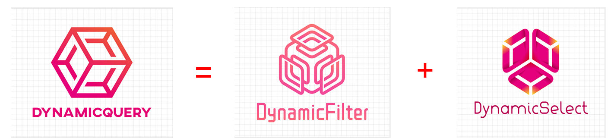
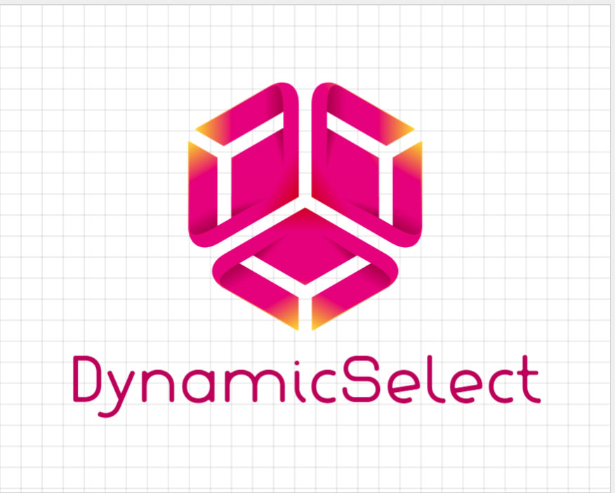

# DynamicQuery



- [DynamicQuery](#dynamicquery)
  * [DynamicQueryRunner](#dynamicqueryrunner)
    + [How QueryLogic looks like serialized](#how-querylogic-looks-like-serialized)
    + [DynamicQueryRunner Example](#dynamicqueryrunner-example)
- [Example](#example)
- [Result](#result)
- [Supported types/operations](#supported-operations)
- [DynamicFilter](#dynamicfilter)
- [Example](#example-1)
- [Result](#result-1)
- [DynamicSelect](#dynamicselect)
- [Example](#example-2)
- [Result](#result-2)


DynamicQuery is a library aimed at allowing developers to easily filter and shape their data at run time by specifying the
`field name`, `filter operations`, `values` and `logical connectors` that are used for the filter, and field names used for selecting the columns, all at runtime.
You could also do it via compile time easily like the example given below. 
It would then dynamically translate the filters, perform necessary table joins and pagination, to obtain the required columns.

In its core, it uses 2 modules, `DynamicFilter` and `DynamicSelect`, each solving a problem unique to it, `Filtering` and `Selecting` respectively.

## DynamicQueryRunner

This class is responsible to translate a `QueryLogic` into sql with the help of `EntityFramework Core`.
A `QueryLogic` is an object that contains the filters that need to be used, and the fields that need to be selected, and how pagination should be done.

It could be populated by the front end and deserialized by the backend using Web Api.

### How QueryLogic looks like serialized

```json
{
  "QueryGroups": [
    {
      "Queries": [
        {
          "PropertyId": "Gender",
          "Operation": "EqualTo",
          "Value": "M"
        },
        {
          "Connector": "AND",
          "PropertyId": "MyName.Name",
          "Operation": "Contains",
          "Value": "Malfoy"
        }
      ]
    }
  ],
  "Projection": {
    "Selections": [
      "Id",
      "MyName.Name",
      "Gender"
    ],
    "PageSize": 1,
    "Page": 1
  }
}
```

### DynamicQueryRunner Single Liner Example

```cs
dynamic result = new DynamicQueryRunner().Build(seedDbContext.Persons, queryLogic).ToDynamicList();
```


# Example

```cs
public class DynamicQueryExample
    {
        public static void Run()
        {
            SeedDbContext seedDbContext = SeedDbContext.Create();

            DynamicQueryBuilder dynamicQueryBuilder = new DynamicQueryBuilder();
           
            //QueryLogic will prolly come in from front end and deserialized by backend.
            QueryLogic queryLogic = dynamicQueryBuilder.Filter
                                                            .AddGroup()
                                                                .By("Gender", Operations.EqualTo, "M")
                                                                .By("MyName.Name", Operations.Contains, "Malfoy", Connector.And)
                                                        .Then
                                                        .Select
                                                            .Fields("Id", "MyName.Name", "Gender")
                                                            .And
                                                            .Paginate(page: 1, pageSize: 1)
                                                        .Then
                                                        .Build();

            dynamic result = new DynamicQueryRunner().Build(seedDbContext.Persons, queryLogic).ToDynamicList();

            string json = JsonConvert.SerializeObject(result, Formatting.Indented);

            Console.WriteLine(json);
        }
    }
```
# Result

```json
[
  {
    "Id": 2,
    "MyName": {
      "Name": "Draco Malfoy"
    },
    "Gender": "M"
  }
]
```

# Supported Operations

- Default
  - EqualTo
  - NotEqualTo
- Text
  - Contains
  - DoesNotContain
  - EndsWith
  - EqualTo
  - IsEmpty
  - IsNotEmpty
  - IsNotNull
  - IsNotNullNorWhiteSpace
  - IsNull
  - IsNullOrWhiteSpace
  - NotEqualTo
  - StartsWith
- Number
  - Between
  - EqualTo
  - GreaterThan
  - GreaterThanOrEqualTo
  - LessThan
  - LessThanOrEqualTo
  - NotEqualTo
- Boolean
  - EqualTo
  - NotEqualTo
- Date
  - Between
  - EqualTo
  - GreaterThan
  - GreaterThanOrEqualTo
  - LessThan
  - LessThanOrEqualTo
  - NotEqualTo

# DynamicFilter


If we don't need the selection capabilities and simply want to use filtering capabilities, just use DynamicFilter. DynamicFilter is a library aimed at allowing developers to easily filter their data at run time by specifying the
`field name`, `filter operations`, `values` and `logical connectors` that are used for the filter.
It would then dynamically translate the filters and construct the sql using an `ORM`

# Example

```cs
    public static class DynamicFilterExample
    {
        public static void Run()
        {
            SeedDbContext seedDbContext = SeedDbContext.Create();

            Filter<Person> filter = new Filter<Person>();

            filter
                .By("Gender", Operations.EqualTo, "M")
                .And
                .By("MyName.Name", Operations.Contains, "Malfoy");

            List<Person> result = seedDbContext.Persons.Where(filter).ToList();

            string json = JsonConvert.SerializeObject(result, Formatting.Indented);

            Console.WriteLine(json);
        }
    }
```

# Result

```json
[
  {
    "Id": 2,
    "Gender": "M",
    "MyName": {
      "Id": 2,
      "Name": "Draco Malfoy"
    },
    "Departments": [
      {
        "Id": 3,
        "Name": "IT",
        "Sections": [
          {
            "Id": 6,
            "Name": "IT-A"
          }
        ]
      },
      {
        "Id": 4,
        "Name": "HR",
        "Sections": [
          {
            "Id": 7,
            "Name": "HR-A"
          }
        ]
      }
    ]
  }
]
```

# DynamicSelect



If we don't need the filtering capabilities and simply want to use the selection capabilities, just use DynamicSelect. DynamicSelect is a library aimed at allowing developers to easily shape their data at run time by specifying the
fields that they want. It would then dynamically perform the neccessary joins for you through `EntityFramework Core`.

# Example

```cs
    public static class DynamicSelectExample
    {
        public static void Run()
        {
            SeedDbContext seedDbContext = SeedDbContext.Create();

            
            dynamic result = seedDbContext.Persons.ProjectToDynamic(
                "Id", "Gender", "MyName.Name", "Departments[Name]", "Departments[Sections[Name]]"
                );

            string json = JsonConvert.SerializeObject(result, Formatting.Indented);

            Console.WriteLine(json);
        }
    }
```

# Result

```json
[
  {
    "Id": 1,
    "Gender": "F",
    "MyName": {
      "Name": "Jane Doe"
    },
    "Departments": [
      {
        "Name": "IT",
        "Sections": [
          {
            "Name": "IT-A"
          },
          {
            "Name": "IT-B"
          }
        ]
      },
      {
        "Name": "HR",
        "Sections": [
          {
            "Name": "HR-A"
          },
          {
            "Name": "HR-B"
          },
          {
            "Name": "HR-C"
          }
        ]
      }
    ]
  }]
```
